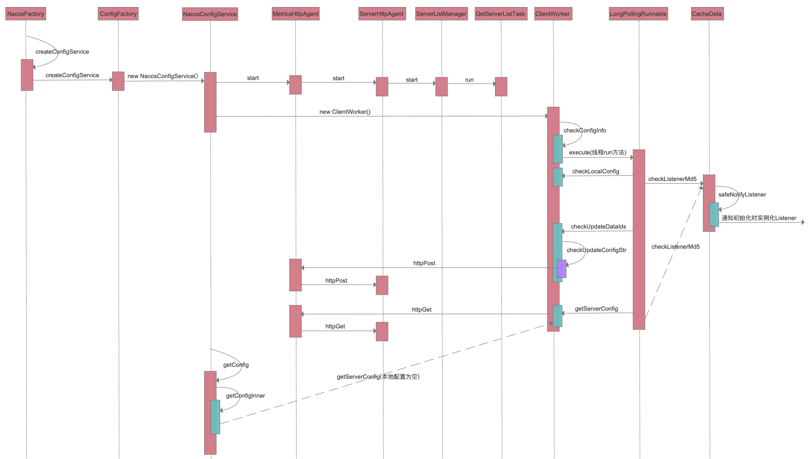

nacos-source-study

# 一、nacos

​		Nacos 支持基于 DNS 和基于 RPC 的服务发现（可以作为springcloud的注册中心）、动态配置服务（可以做配置中心）、动态 DNS 服务。

**基本使用**

依赖包引入，在build.gradle加入依赖

```xml
//服务注册
compile 'com.alibaba.cloud:spring-cloud-starter-alibaba-nacos-discovery:2.2.3.RELEASE'
//配置中心
compile 'com.alibaba.cloud:spring-cloud-starter-alibaba-nacos-config:2.2.3.RELEASE'
```

在bootstrap.yml文件中加入如下配置

```yaml
spring:
  profiles:
    active: test
  application:
    name: user-center
  cloud:
    nacos:
    	#服务注册发现
      discovery:
        server-addr: 127.0.0.1:8848
        namespace: ccc40fcb-625e-454e-93b6-3b1505df1d15
      #配置中心
      config:
        server-addr: 127.0.0.1:8848
        file-extension: yaml
        namespace: ccc40fcb-625e-454e-93b6-3b1505df1d15
        #扩展配置
        extension-configs:
        - data-id: devops-share-test.yaml
          group: DEFAULT_GROUP
          refresh: true
```

注意：

1、nacos-config相关的配置在`bootstrap.yaml|properties|yml`(在application的配置文件无效)
2、开启data-id动态刷新
3、使用`@RefreshScope`注解

4、注意缓存问题

​	a.获取扩展配置相关属性时，总是取不到相应的值，报错注入失败；

​	b.nacos修改配置后缀名，删除原有配置，启动也会报错。比如原有配置文件名user-center-test.yml,删除后重建为user-center-test.yaml后，启动报错

​	解决方案：重启nacos服务


# 二、源码分析

​		nacos配置中心，获取配置源码分析，其入口在NacosFactory类。

```java
//获取配置中心配置代码，其入口是NacosFactory类
ConfigService configService = NacosFactory.createConfigService(properties);
configService.addListener(dataId, groupId, new Listener() {
  @Override
  public Executor getExecutor() {
    return null;
  }
  @Override
  public void receiveConfigInfo(String configInfo) {
    System.out.println("configInfo:"+configInfo);
  }
});
String content = configService.getConfig(dataId,groupId,3000);

进入NacosFactory类public static ConfigService createConfigService(Properties properties) throws NacosException方法，NacosFactory#createConfigService()
  ConfigService configService = NacosFactory.createConfigService(properties);

进入ConfigFactory类public static ConfigService createConfigService(Properties properties) throws NacosException方法，ConfigFactory#createConfigService()
  return ConfigFactory.createConfigService(properties);
	//源码
	public static ConfigService createConfigService(Properties properties) throws NacosException {
    try {
      Class<?> driverImplClass = Class.forName("com.alibaba.nacos.client.config.NacosConfigService");
      Constructor constructor = driverImplClass.getConstructor(Properties.class);
      //反射NacosConfigService实例，进入该类构造函数
      ConfigService vendorImpl = (ConfigService) constructor.newInstance(properties);
      return vendorImpl;
    } catch (Throwable e) {
      throw new NacosException(NacosException.CLIENT_INVALID_PARAM, e);
    }
  }

进入NacosConfigService类构造函数public NacosConfigService(Properties properties) throws NacosException
	ConfigService vendorImpl = (ConfigService) constructor.newInstance(properties);
	//源码
  public NacosConfigService(Properties properties) throws NacosException {
    ValidatorUtils.checkInitParam(properties);
    String encodeTmp = properties.getProperty(PropertyKeyConst.ENCODE);
    if (StringUtils.isBlank(encodeTmp)) {
      this.encode = Constants.ENCODE;
    } else {
      this.encode = encodeTmp.trim();
    }
    initNamespace(properties);
		
    //装饰器模式，MetricsHttpAgent做了一个监控统计
    this.agent = new MetricsHttpAgent(new ServerHttpAgent(properties));
    this.agent.start();
    this.worker = new ClientWorker(this.agent, this.configFilterChainManager, properties);
  }

进入MetricsHttpAgent类public void start() throws NacosException方法，MetricsHttpAgent#start()
  this.agent.start();

进入ServerHttpAgent类public void start() throws NacosException方法，ServerHttpAgent#start()
  httpAgent.start();

进入ServerListManager类public synchronized void start() throws NacosException方法，ServerListManager#start()
  serverListMgr.start();

进入ServerListManager内部类GetServerListTask类public void run()方法
  getServersTask.run();

回到类NacosConfigService类构造函数public NacosConfigService(Properties properties) throws NacosException，继续执行
  this.worker = new ClientWorker(this.agent, this.configFilterChainManager, properties);

进入ClientWorker类构造函数public ClientWorker(final HttpAgent agent, final ConfigFilterChainManager configFilterChainManager, final Properties properties)
  //源码
  public ClientWorker(final HttpAgent agent, final ConfigFilterChainManager configFilterChainManager,
              final Properties properties) {
    this.agent = agent;
    this.configFilterChainManager = configFilterChainManager;

    // Initialize the timeout parameter

    init(properties);
		
  	//worker线程
    this.executor = Executors.newScheduledThreadPool(1, new ThreadFactory() {
      @Override
      public Thread newThread(Runnable r) {
        Thread t = new Thread(r);
        t.setName("com.alibaba.nacos.client.Worker." + agent.getName());
        t.setDaemon(true);
        return t;
      }
    });
		
  	//长轮询线程
    this.executorService = Executors
      .newScheduledThreadPool(Runtime.getRuntime().availableProcessors(), new ThreadFactory() {
        @Override
        public Thread newThread(Runnable r) {
          Thread t = new Thread(r);
          t.setName("com.alibaba.nacos.client.Worker.longPolling." + agent.getName());
          t.setDaemon(true);
          return t;
        }
      });
		
  	//每10毫秒检查配置
    this.executor.scheduleWithFixedDelay(new Runnable() {
      @Override
      public void run() {
        try {
          checkConfigInfo();
        } catch (Throwable e) {
          LOGGER.error("[" + agent.getName() + "] [sub-check] rotate check error", e);
        }
      }
    }, 1L, 10L, TimeUnit.MILLISECONDS);
  }
	继续调用ClientWorker类方法
  1.public void checkConfigInfo()方法
    checkConfigInfo();
 		//源码
		/**
     * Check config info.
     */
    public void checkConfigInfo() {
        // Dispatch taskes.  groupKey -> cacheData.
        int listenerSize = cacheMap.get().size();
        // Round up the longingTaskCount. 
      	//分任务进行处理，假设有5000数据，那么久分2个任务去check
        int longingTaskCount = (int) Math.ceil(listenerSize / ParamUtil.getPerTaskConfigSize());
        if (longingTaskCount > currentLongingTaskCount) {
            for (int i = (int) currentLongingTaskCount; i < longingTaskCount; i++) {
                // The task list is no order.So it maybe has issues when changing.
              	//executorService是构造函数中构造出来长轮询的任务
                executorService.execute(new LongPollingRunnable(i));
            }
            currentLongingTaskCount = longingTaskCount;
        }
    }

进入ClientWorker内部类LongPollingRunnable类public void run()方法
  executorService.execute(new LongPollingRunnable(i));

回到ClientWorker类，继续调用private void checkLocalConfig(CacheData cacheData)方法
  checkLocalConfig(cacheData);
  //源码
  private void checkLocalConfig(CacheData cacheData) {
    final String dataId = cacheData.dataId;
    final String group = cacheData.group;
    final String tenant = cacheData.tenant;
    File path = LocalConfigInfoProcessor.getFailoverFile(agent.getName(), dataId, group, tenant);
		
    //内存缓存不存在，本地文件存在
    if (!cacheData.isUseLocalConfigInfo() && path.exists()) {
      String content = LocalConfigInfoProcessor.getFailover(agent.getName(), dataId, group, tenant);
      final String md5 = MD5Utils.md5Hex(content, Constants.ENCODE);
      cacheData.setUseLocalConfigInfo(true);
      cacheData.setLocalConfigInfoVersion(path.lastModified());
      cacheData.setContent(content);

      LOGGER.warn(
        "[{}] [failover-change] failover file created. dataId={}, group={}, tenant={}, md5={}, content={}",
        agent.getName(), dataId, group, tenant, md5, ContentUtils.truncateContent(content));
      return;
    }

    //缓存存在，本地文件不存在
    // If use local config info, then it doesn't notify business listener and notify after getting from server.
    if (cacheData.isUseLocalConfigInfo() && !path.exists()) {
      cacheData.setUseLocalConfigInfo(false);
      LOGGER.warn("[{}] [failover-change] failover file deleted. dataId={}, group={}, tenant={}", agent.getName(),
                  dataId, group, tenant);
      return;
    }

    //有变更
    // When it changed.
    if (cacheData.isUseLocalConfigInfo() && path.exists() && cacheData.getLocalConfigInfoVersion() != path
        .lastModified()) {
      String content = LocalConfigInfoProcessor.getFailover(agent.getName(), dataId, group, tenant);
      final String md5 = MD5Utils.md5Hex(content, Constants.ENCODE);
      cacheData.setUseLocalConfigInfo(true);
      cacheData.setLocalConfigInfoVersion(path.lastModified());
      cacheData.setContent(content);
      LOGGER.warn(
        "[{}] [failover-change] failover file changed. dataId={}, group={}, tenant={}, md5={}, content={}",
        agent.getName(), dataId, group, tenant, md5, ContentUtils.truncateContent(content));
    }
  }

回到ClientWorker内部类LongPollingRunnable类public void run()方法，继续执行，进入CacheData类void checkListenerMd5()方法
  cacheData.checkListenerMd5();
	继续调用CacheData类方法
  1.private void safeNotifyListener(final String dataId, final String group, final String content, final String type, final String md5, final ManagerListenerWrap listenerWrap)方法
    safeNotifyListener(dataId, group, content, type, md5, wrap);
	继续执行，次出listener就是初始化时Listener实例,实际是一个回调
	listener.receiveConfigInfo(contentTmp);
	//Listener实例
  configService.addListener(dataId, groupId, new Listener() {
    @Override
    public Executor getExecutor() {
      return null;
    }
    @Override
    public void receiveConfigInfo(String configInfo) {
      System.out.println("configInfo:"+configInfo);
    }
  });

回到ClientWorker内部类LongPollingRunnable类public void run()方法，继续执行，调用ClientWorker类List<String> checkUpdateDataIds(List<CacheData> cacheDatas, List<String> inInitializingCacheList) hrows IOException方法
  //检查变化了的dataId,http请求检查是否变化
  List<String> changedGroupKeys = checkUpdateDataIds(cacheDatas, inInitializingCacheList);
	继续调用ClientWorker方法
  1.List<String> checkUpdateConfigStr(String probeUpdateString, boolean isInitializingCacheList) throws IOException方法
	return checkUpdateConfigStr(sb.toString(), isInitializingCacheList);

进入MetricsHttpAgent类public HttpResult httpPost(String path, List<String> headers, List<String> paramValues, String encoding, long readTimeoutMs) throws IOException方法
   HttpResult result = agent.httpPost(Constants.CONFIG_CONTROLLER_PATH + "/listener", headers, params, agent.getEncode(), readTimeoutMs);

进入ServerHttpAgent类public HttpResult httpPost(String path, List<String> headers, List<String> paramValues, String encoding, long readTimeoutMs) throws IOException方法
  result = httpAgent.httpPost(path, headers, paramValues, encoding, readTimeoutMs);

回到ClientWorker内部类LongPollingRunnable类public void run()方法，继续执行，调用public String[] getServerConfig(String dataId, String group, String tenant, long readTimeout) throws NacosException方法
  String[] ct = getServerConfig(dataId, group, tenant, 3000L);

进入MetricsHttpAgent类public HttpResult httpGet(String path, List<String> headers, List<String> paramValues, String encoding, long readTimeoutMs) throws IOException方法
	result = agent.httpGet(Constants.CONFIG_CONTROLLER_PATH, null, params, agent.getEncode(), readTimeout);

进入ServerHttpAgent类public HttpResult httpGet(String path, List<String> headers, List<String> paramValues, String encoding, long readTimeoutMs) throws IOException方法
  result = httpAgent.httpGet(path, headers, paramValues, encoding, readTimeoutMs);

初始化分析结束，下一步获取config
  String content = configService.getConfig(dataId,groupId,3000);
进入NacosConfigService类public String getConfig(String dataId, String group, long timeoutMs) throws NacosException方法
  String content = configService.getConfig(dataId,groupId,3000);
	继续调用NacosConfigService类方法
  1.private String getConfigInner(String tenant, String dataId, String group, long timeoutMs) throws NacosException
    return getConfigInner(namespace, dataId, group, timeoutMs);
	// 本地配置为空，则进入ClientWorker类public String[] getServerConfig(String dataId, String group, String tenant, long readTimeout) throws NacosException方法
	String[] ct = worker.getServerConfig(dataId, group, tenant, timeoutMs);
```

nacos配置中心时序图




注意：

​		长轮询超时时间是30秒，诺服务端29.5秒内仍未返回，会提前0.5秒响应该次请求，以防超时。但是如果配置变更，会实时响应该次请求。

```java
int delayTime = SwitchService.getSwitchInteger(SwitchService.FIXED_DELAY_TIME, 500);
// Add delay time for LoadBalance, and one response is returned 500 ms in advance to avoid client timeout.
long timeout = Math.max(10000, Long.parseLong(str) - delayTime);
```

客服端请求日志,在日志文件config-client-request.log中，其中第二列是长轮询响应时间，由日志看，基本在29.5秒左右

```
2020-10-08 16:25:46,714|29505|timeout|127.0.0.1|polling|4|346
2020-10-08 16:26:16,221|29505|timeout|127.0.0.1|polling|4|346
2020-10-08 16:26:45,729|29506|timeout|127.0.0.1|polling|4|346
2020-10-08 16:27:15,236|29506|timeout|127.0.0.1|polling|4|346
2020-10-08 16:27:44,743|29506|timeout|127.0.0.1|polling|4|346
2020-10-08 16:28:14,250|29505|timeout|127.0.0.1|polling|4|346
2020-10-08 16:28:43,757|29505|timeout|127.0.0.1|polling|4|346
2020-10-08 16:29:13,265|29505|timeout|127.0.0.1|polling|4|346
2020-10-08 16:29:42,772|29505|timeout|127.0.0.1|polling|4|346
```

长轮询请求地址:/v1/cs/configs/listener

```java
//ClientWorker类List<String> checkUpdateConfigStr(String probeUpdateString, boolean isInitializingCacheList) throws IOException方法 
HttpResult result = agent.httpPost(Constants.CONFIG_CONTROLLER_PATH + "/listener", headers, params, agent.getEncode(), readTimeoutMs);

超时时间30秒，服务端减去0.5秒，最多等待29.5秒
int delayTime = SwitchService.getSwitchInteger(SwitchService.FIXED_DELAY_TIME, 500);
// Add delay time for LoadBalance, and one response is returned 500 ms in advance to avoid client timeout.
long timeout = Math.max(10000, Long.parseLong(str) - delayTime);
```


